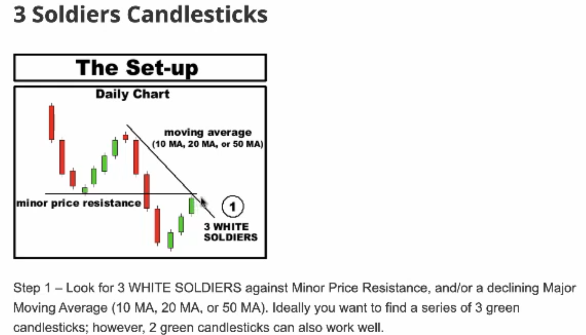

# Intro

Dow starting off on a down day, probably rona virus fears.  When stocks open down, you normally ask, when does this downtrend reverse?  When can we find a **bullish reversal?** where we can place a favorable **risk/reward** setup?  There is a series of [candlestick patterns](https://www.traderslog.com/three-soldiers-candlestick) that describe this.

- 3 soldiers: 3 bullish candlesticks in a row. Here you could place a **bracket order** when the 3rd candle forms

set stop loss before first candlestick, set profit target double the length of the 3 candles